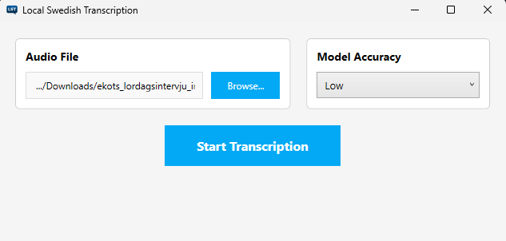
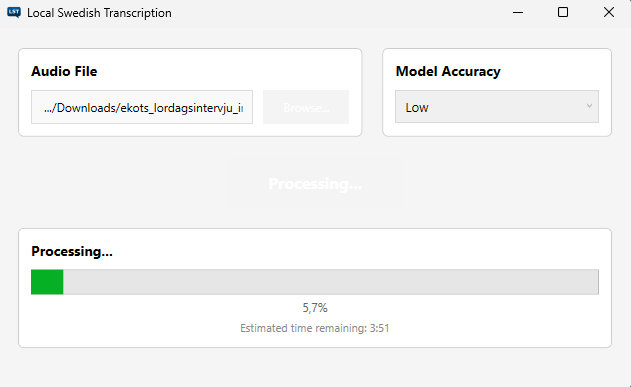

# LST - Local Speech Transcriber

LST (Local Speech Transcriber) is a **desktop application** that converts audio files into text. It works completely **offline** on your computer - no internet connection needed!

## 🎯 What Does It Do?

Think of LST as a personal assistant that listens to your audio recordings and types out everything that was said. Whether you have:
- 🎙️ Recorded interviews
- 📻 Radio programs
- 🎧 Podcasts
- 💼 Meeting recordings
- 🎵 Any other audio file (MP3, WAV, M4A, FLAC, OGG)

LST will transform them into written text that you can read, edit, and share.

## Download (Windows)
Click to download the latest installer:
https://github.com/JavierKipen/LST/releases/download/LST/LSTSetup.exe

Release notes:
https://github.com/JavierKipen/LST/releases/latest

Installation: download the .exe, run it, and follow the installer.
Note: do not use “Code → Download ZIP” (that is the source code).

## ✨ Key Features

- **🔒 100% Private**: Everything happens on your computer - your audio never leaves your device
- **🌐 Works Offline**: No internet connection required
- **🎯 Multiple Accuracy Levels**: Choose between speed and accuracy based on your needs
- **📊 Progress Tracking**: Watch the transcription progress in real-time
- **⏱️ Time Stamps**: Results include timestamps so you know when each part was said
- **🇸🇪 Swedish Language Optimized**: Currently optimized for Swedish audio transcription


## **GUI Version** (Recommended for Most Users)
A simple, easy-to-use application with buttons and a visual interface.

**Perfect if you:**
- Want a straightforward, point-and-click experience
- Don't have programming experience
- Just want to drag, drop, and transcribe

**How it looks:**
- Browse button to select your audio file
- Dropdown menu to choose accuracy level
- Progress bar showing how far along the transcription is
- Automatic saving of results to a text file





## 🚀 Getting Started

### Installation
1. Download the LST installer from the releases page
2. Run the installer and follow the on-screen instructions
3. The installer will download the necessary AI models (these help with transcription accuracy)
4. Once installed, you're ready to start transcribing!

### Using the GUI Version

**Step 1: Launch the Application**
- Find "LST" in your Start Menu or desktop shortcut
- Double-click to open

**Step 2: Select Your Audio File**
- Click the "Browse" button
- Navigate to your audio file and select it
- The file path will appear in the text box

**Step 3: Choose Accuracy Level**
- **Very Low**: Fastest, but less accurate (good for rough drafts)
- **Low**: Good balance for quick transcriptions
- **Medium**: Better accuracy, takes more time
- **Good**: High accuracy, slower processing
- **Very Good**: Best accuracy, longest processing time

💡 *Tip: Start with "Low" to see how it works, then try higher levels if needed*

**Step 4: Start Transcription**
- Click "Start Transcription"
- Watch the progress bar as your audio is processed
- When complete, a text file will be saved in the same folder as your audio file

**Step 5: Find Your Results**
- Look for a `.txt` file with the same name as your audio file
- Open it with Notepad or any text editor
- The transcription includes timestamps like: `[00:00:00->00:00:30]` followed by the text


## 🔧 How It Works (Technical Overview)

LST uses **Whisper.net**, which is based on OpenAI's Whisper AI model. Here's what happens behind the scenes:

1. **Audio Loading**: Your audio file is loaded and converted into a format the AI can understand
2. **Pre-processing**: The audio is converted to 16kHz mono (single channel) format
3. **AI Processing**: The Whisper model analyzes the audio and generates text
4. **Post-processing**: Timestamps are added and text is formatted into readable blocks
5. **Saving**: The final transcription is saved as a text file

### Model Files
LST uses different AI models for different accuracy levels:
- `kb-ggml-tiny.bin` - Very Low accuracy (fastest)
- `kb-ggml-base.bin` - Low accuracy
- `kb-ggml-small.bin` - Medium accuracy
- `kb-ggml-medium.bin` - Good accuracy
- `kb-ggml-large.bin` - Very Good accuracy (slowest, most accurate)

These models are automatically included when you install LST. These models are from the paper Swedish Whispers; Leveraging a Massive Speech Corpus for Swedish Speech
Recognition" ( https://arxiv.org/pdf/2505.17538? ).

## 🛠️ Troubleshooting

**Problem: Application won't start**
- Solution: Make sure you have installed all required components during installation
- Try reinstalling the application

**Problem: "Models directory not found" error**
- Solution: The AI model files are missing. Reinstall the application to download them.

**Problem: Transcription is very slow**
- Solution: Try a lower accuracy setting.

**Problem: Transcription quality is poor**
- Solution: Use a higher accuracy setting, ensure audio quality is good, and minimize background noise.

## 📚 For Developers

### Project Structure
```
LST/
├── Transcriber.Core/          # Terminal version (console application)
│   ├── main.cs               # Entry point for terminal app
│   ├── Transcriptor.cs       # Core transcription logic
│   ├── WhisperAudioPreProcessor.cs
│   └── LST.Terminal.csproj
│
├── GUI/                      # GUI version (Windows desktop app)
│   ├── MainWindow.xaml       # UI layout
│   ├── MainWindow.xaml.cs    # UI logic and event handlers
│   ├── Transcriptor.cs       # Same core logic as terminal version
│   ├── WhisperAudioPreProcessor.cs
│   └── GUI.csproj
│
└── Models/                   # AI model files (.bin files)
    └── kb-ggml-*.bin        # Whisper models for Swedish
```

### Technologies Used
- **.NET 10**: Modern C# framework
- **WPF**: For the graphical user interface
- **Whisper.net**: AI-powered speech recognition
- **NAudio**: Audio file processing

### Building from Source
1. Clone the repository
2. Open the solution in Visual Studio 2022 or later
3. Download the required Whisper model files and place them in the `Models/` folder
4. Build the solution (Build → Build Solution)
5. Run either the GUI or Terminal project

### Contributing
Contributions are welcome! Whether it's bug reports, feature requests, or code contributions, feel free to open an issue or pull request.

## 📄 License
This project is licensed under the PolyForm Noncommercial License 1.0.0.
Noncommercial use is permitted ("Any noncommercial purpose is a permitted purpose").
Commercial use requires a separate license—contact: javier1kipen@gmail.com

## 💖 Donations
Donations are welcome and help fund development and maintenance.
Donations do not grant commercial-use rights; commercial use requires a separate license—contact: javier1kipen@gmail.com

PayPal Link: https://www.paypal.com/donate/?hosted_button_id=YQLF4ET86YSBS
